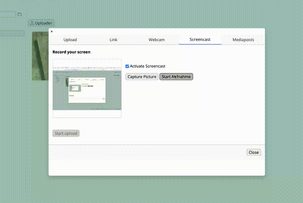

# SpicyCamCast

SpicyCamCast is a JavaScript library for easy camera and screencast access. Less than 3 KBy minified it provides
a simple API to interact with media devices, capture photos, and start/stop video streams.
The classes were inspired by Benson Ruan [webcam-easy](https://github.com/bensonruan/webcam-easy) library.

SpicyCamCast leverages modern JavaScript features such as ES6 classes,
private fields, promises, and async/await for asynchronous operations. 
This ensures a clean and maintainable codebase.



## Features

- Detect and select video devices
- Start and stop camera streams
- Start and stop screencast streams
- Capture photos in various formats (JPEG, PNG, WebP)
- Mirror video streams

## Installation

To install SpicyCamCast, clone the repository:

```sh
git clone https://github.com/sagiadinos/SpicyCamCast.git
```

## Usage SpicyCam-Lib

### Importing the Cam Library

```javascript
import { SpicyCam } from './src/SpicyCam.js';
```

### Starting a Camera Stream

```javascript
const videoElement = document.querySelector('video');
const spicyCam = new SpicyCam(videoElement);

spicyCam.justStart().then(() => {
  console.log('Camera started');
}).catch(error => {
  console.error('Error starting camera:', error);
});
```

### Starting a Screencast Stream

```javascript
const videoElement = document.querySelector('video');
const spicyCast = new SpicyCast(videoElement);

spicyCast.startScreencast().then(() => {
  console.log('Screencast started');
}).catch(error => {
  console.error('Error starting screencast:', error);
});
```

### Capturing a Photo

Captures a photo from the video stream and returns it as a
JPEG data URL.
It is also possible to capture photos in PNG and WebP formats.

```javascript
const canvasElement = document.querySelector('canvas');
const photoDataUrl = spicyCam.capturePhotoAsJpeg(canvasElement);
console.log('Captured photo:', photoDataUrl);
```
